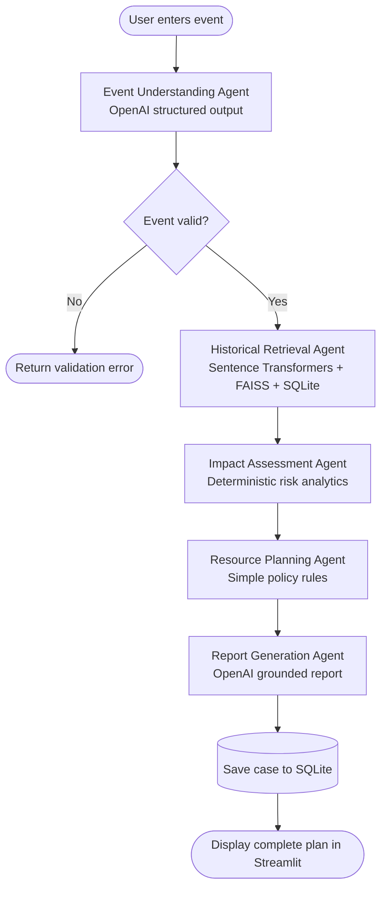

# AI Traffic Operations Copilot

## Final Simplified MVP Architecture

Status: **Architecture only — no application code generated**

## 1. MVP objective

Build a working hackathon demo that converts an event description into an evidence-backed Traffic Management Plan using:

- LangGraph for orchestration;
- Streamlit for the user interface;
- OpenAI for event extraction and report writing;
- Sentence Transformers and FAISS for historical retrieval;
- Pandas for deterministic analytics;
- SQLite for lightweight persistence.

The MVP estimates **Operational Disruption Risk**. It does not predict traffic speed, delay, vehicle volume, queue length, or precise congestion.

## 2. Simplified system architecture

```text
Historical CSV
    |
    v
One-time ingestion
    +--> Cleaned event records --> SQLite: events
    +--> Event text embeddings --> FAISS index

User
    |
    v
Two-page Streamlit application
    |
    +--> Page 1: Traffic Operations Copilot
    |       |
    |       v
    |    Five-node LangGraph
    |       1. Event Understanding
    |       2. Historical Retrieval
    |       3. Impact Assessment
    |       4. Resource Planning
    |       5. Report Generation
    |       |
    |       +--> OpenAI: nodes 1 and 5 only
    |       +--> FAISS + SQLite: historical evidence
    |       +--> Pandas: statistics and risk calculation
    |       +--> SQLite: save case and optional feedback
    |
    +--> Page 2: Historical Event Explorer
            |
            +--> Search/filter SQLite events
            +--> Semantic search through FAISS
            +--> Display Pandas statistics
```

### Deliberate MVP exclusions

- no Human Review Agent;
- no Diversion Planning Agent;
- no post-event LangGraph node;
- no policy-versioning framework;
- no audit subsystem;
- no external routing service;
- no production authentication or role management;
- no separate backend API;
- no microservices or cloud vector database.

## 3. Five LangGraph nodes

### 3.1 Event Understanding Agent

Purpose:

- accept the Streamlit form and free-text description;
- use OpenAI structured output to create a normalized event object;
- categorize the event as planned or unplanned;
- identify cause, corridor, priority, road-closure expectation, location, timing, vehicle type, and operational notes;
- validate required fields.

OpenAI is appropriate here because the task involves interpreting natural language.

If extraction fails or required information is missing, the graph stops and returns a clear validation message to the form.

### 3.2 Historical Retrieval Agent

Purpose:

- build a canonical text query from the structured event;
- embed it with Sentence Transformers;
- retrieve semantic candidates from FAISS;
- improve relevance with simple exact-match bonuses for event cause, corridor, event type, priority, and closure pattern;
- load full event details from SQLite;
- calculate summary statistics with Pandas.

Output:

- top five similar events for display;
- a broader evidence cohort for analytics;
- cohort size;
- historical closure-requirement rate;
- priority distribution;
- valid recorded-handling-duration statistics;
- match-quality score.

This node is deterministic after the embedding search. It does not use OpenAI.

### 3.3 Impact Assessment Agent

Purpose:

- calculate a transparent Operational Disruption Risk score from historical evidence and current event characteristics;
- assign Low, Moderate, High, or Critical risk;
- produce plain-language reasons and limitations.

Suggested score:

| Component | Weight |
|---|---:|
| Historical road-closure requirement among similar events | 30 |
| Current event priority | 20 |
| Event-cause operational burden | 20 |
| Valid historical handling duration | 15 |
| Planned/unplanned urgency and timing | 10 |
| Evidence uncertainty | 5 |

Risk bands:

- 0–29: Low;
- 30–54: Moderate;
- 55–74: High;
- 75–100: Critical.

The result must show component values, cohort size, and data limitations. The score is calculated with Python and Pandas, not an LLM or classifier.

### 3.4 Resource Planning Agent

Purpose:

- recommend a manpower range;
- recommend a barricade range;
- recommend support vehicles;
- explain which event characteristics triggered each recommendation.

The dataset contains no historical manpower or barricade quantities. Therefore:

- historical patterns may determine operational triggers such as closure tendency, cause burden, priority, and duration;
- the actual quantities are simple hackathon policy heuristics;
- the UI and report must label them as **policy-based recommendations, not learned predictions**.

Example rule shape:

| Risk band | Manpower | Barricades |
|---|---:|---:|
| Low | 2–4 | 0–4 |
| Moderate | 4–6 | 4–8 |
| High | 6–10 | 8–14 |
| Critical | 10–16 | 14–24 |

Simple modifiers:

- add control posts when road closure is required;
- recommend a tow vehicle for vehicle breakdowns;
- recommend ambulance/rescue coordination for accidents;
- recommend utility or recovery support for tree fall, debris, water logging, or road damage;
- recommend additional entry/exit control for public events, processions, protests, and VIP movement;
- recommend patrol support for high-risk events.

This node uses deterministic Python rules and no OpenAI call.

### 3.5 Report Generation Agent

Purpose:

- send the approved structured outputs to OpenAI;
- generate a concise Traffic Management Plan;
- avoid introducing facts or recommendations that are absent from the graph state.

Report sections:

1. Event summary;
2. Historical evidence;
3. Operational Disruption Risk;
4. Resource deployment recommendation;
5. Immediate operational actions;
6. Monitoring checklist;
7. Assumptions and limitations.

The prompt must explicitly prohibit precise congestion, speed, delay, crowd-size, or route claims.

## 4. Folder structure

```text
traffic-operations-copilot/
├── app.py
├── pages/
│   └── 2_Historical_Event_Explorer.py
├── src/
│   ├── graph.py
│   ├── state.py
│   ├── nodes/
│   │   ├── event_understanding.py
│   │   ├── historical_retrieval.py
│   │   ├── impact_assessment.py
│   │   ├── resource_planning.py
│   │   └── report_generation.py
│   ├── data/
│   │   ├── ingestion.py
│   │   └── preprocessing.py
│   ├── services/
│   │   ├── embeddings.py
│   │   ├── retrieval.py
│   │   ├── analytics.py
│   │   ├── risk_scoring.py
│   │   └── database.py
│   ├── schemas.py
│   └── config.py
├── data/
│   ├── raw/
│   │   └── events.csv
│   ├── traffic_ops.db
│   ├── events.faiss
│   └── faiss_event_ids.json
├── scripts/
│   └── build_data_store.py
├── tests/
│   ├── test_risk_scoring.py
│   ├── test_retrieval.py
│   └── test_graph.py
├── docs/
│   └── final_simplified_mvp_architecture.md
├── .env
├── .env.example
├── requirements.txt
└── README.md
```

`app.py` is Page 1. Streamlit automatically exposes the file under `pages/` as Page 2.

## 5. LangGraph state schema

The graph uses one compact shared state.

| State field | Type/shape | Purpose |
|---|---|---|
| `case_id` | string | Unique generated case identifier |
| `user_input` | string | Original officer description |
| `form_data` | object | Explicit form fields supplied by the user |
| `event` | structured object | Normalized event produced by OpenAI |
| `validation_errors` | list of strings | Missing or invalid event information |
| `similar_events` | list of event summaries | Top five events shown in the UI |
| `evidence_event_ids` | list of strings | Broader cohort used for analytics |
| `historical_stats` | structured object | Counts, rates, duration statistics, and coverage |
| `retrieval_confidence` | number from 0 to 1 | Simple evidence-quality indicator |
| `risk_assessment` | structured object | Score, band, components, reasons, and limitations |
| `resource_plan` | structured object | Manpower, barricades, vehicles, and rationale |
| `report` | string | Final Traffic Management Plan |
| `error` | optional string | Recoverable graph or API failure |

### Structured event fields

- `event_type`;
- `event_cause`;
- `description`;
- `corridor`;
- `priority`;
- `requires_road_closure`;
- `start_datetime`;
- `end_datetime`;
- `address`;
- `latitude`;
- `longitude`;
- `police_station`;
- `vehicle_type`;
- `operational_notes`.

### Historical statistics fields

- `cohort_size`;
- `cause_match_count`;
- `corridor_match_count`;
- `closure_rate`;
- `high_priority_rate`;
- `median_handling_hours`;
- `handling_duration_sample_size`;
- `planned_event_rate`;
- `data_quality_notes`.

### Risk-assessment fields

- `score`;
- `band`;
- `components`;
- `reasons`;
- `confidence`;
- `limitations`.

### Resource-plan fields

- `manpower_min`;
- `manpower_max`;
- `barricades_min`;
- `barricades_max`;
- `support_vehicles`;
- `deployment_notes`;
- `rationale`;
- `policy_disclaimer`.

## 6. Workflow diagram



The successful graph is intentionally linear. The only conditional path handles invalid or failed event extraction.

## 7. Streamlit MVP

### Page 1 — Traffic Operations Copilot

#### Input panel

- event description;
- planned/unplanned selection, with Auto as an option;
- event cause, with Auto as an option;
- corridor;
- priority;
- start and optional end time;
- road-closure expectation;
- optional vehicle type;
- **Generate Plan** button.

#### Results

- Operational Disruption Risk score and band;
- evidence-confidence indicator;
- component-level risk explanation;
- top five similar historical events;
- historical cohort statistics;
- manpower and barricade ranges;
- support-vehicle recommendations;
- generated Traffic Management Plan;
- optional compact post-event feedback expander.

The interface should reveal results in graph order so judges can see each agent contributing.

### Page 2 — Historical Event Explorer

#### Filters

- keyword or natural-language semantic search;
- event type;
- event cause;
- corridor;
- priority;
- road closure;
- date range.

#### Outputs

- matching event count;
- cause distribution;
- corridor distribution;
- closure-requirement rate;
- priority distribution;
- valid recorded-handling-duration summary;
- event table;
- top semantic matches when a natural-language query is supplied.

The page reads directly from SQLite, Pandas, and FAISS. It does not run the full LangGraph.

## 8. SQLite database

Only three tables are required.

### `events`

Stores cleaned historical CSV records and derived fields needed for retrieval and analytics.

Important columns:

- event ID;
- event type and cause;
- description;
- corridor, police station, address, coordinates;
- priority and closure requirement;
- start/end/closed/resolved timestamps;
- valid scheduled and handling durations;
- vehicle type;
- canonical embedding text;
- data-quality flags.

### `cases`

Stores each generated copilot plan.

Important columns:

- case ID;
- original user input;
- structured event JSON;
- similar-event IDs JSON;
- historical statistics JSON;
- risk assessment JSON;
- resource plan JSON;
- generated report;
- creation time.

### `feedback`

Stores optional post-event observations without adding another LangGraph agent.

Important columns:

- feedback ID;
- case ID;
- actual closure used;
- actual handling duration;
- actual manpower;
- actual barricades;
- support vehicles used;
- observed operational impact;
- notes;
- submission time.

Feedback is stored for demonstration and future improvement. The MVP does not automatically retrain or recalibrate itself.

## 9. Historical retrieval design

### One-time build

1. Read the supplied CSV.
2. Normalize cause labels and null values.
3. Parse mixed-format timestamps.
4. calculate valid duration fields and quality flags.
5. Create one canonical text document per event.
6. Generate embeddings with `all-MiniLM-L6-v2`.
7. Normalize vectors and store them in a FAISS inner-product index.
8. Store event records in SQLite.
9. Save the FAISS-position-to-event-ID mapping.

### Runtime search

1. Convert the structured event into canonical query text.
2. Generate its embedding.
3. Retrieve the top 30 FAISS candidates.
4. Rerank them with simple metadata bonuses.
5. Select the top five for display.
6. Use up to 30 relevant candidates as the analytics cohort.

Suggested reranking:

- semantic similarity: 60%;
- exact event cause: 15%;
- exact corridor: 10%;
- planned/unplanned match: 5%;
- priority match: 5%;
- road-closure-pattern match: 5%.

## 10. Step-by-step implementation plan

### Step 1 — Project setup

- create the simplified folders;
- add environment-variable configuration;
- add and pin the required packages;
- place the CSV in `data/raw/`;
- verify the OpenAI API connection with a minimal structured-output test.

Result: runnable project shell with no business logic.

### Step 2 — Data ingestion

- load the CSV with Pandas;
- apply the EDA-driven cleaning rules;
- normalize labels;
- parse timestamps;
- create valid duration and quality fields;
- populate the `events` table.

Result: 8,173 source rows reconcile to SQLite.

### Step 3 — Build FAISS retrieval

- generate canonical event text;
- load `all-MiniLM-L6-v2`;
- create embeddings;
- build and save the normalized FAISS index;
- save the event-ID mapping;
- implement semantic search and metadata reranking.

Result: a query returns five explainable similar events.

### Step 4 — Implement deterministic analytics

- calculate historical summary statistics;
- implement the risk formula;
- implement risk bands;
- implement retrieval-confidence calculation;
- add explanations and limitation text;
- unit-test boundary cases.

Result: risk is fully reproducible without OpenAI.

### Step 5 — Implement resource rules

- map risk bands to manpower and barricade ranges;
- add event-cause and closure modifiers;
- add support-vehicle rules;
- generate deterministic rationale;
- display the policy disclaimer.

Result: every recommendation can be traced to a rule.

### Step 6 — Implement OpenAI nodes

- define the structured event schema;
- implement event extraction;
- validate extracted fields;
- create the grounded report prompt;
- validate that the report does not invent unsupported congestion or routing claims;
- add friendly API-error handling.

Result: OpenAI performs interpretation and writing only.

### Step 7 — Assemble LangGraph

- define the shared state;
- connect the five nodes in order;
- add the invalid-event exit;
- return partial error information safely;
- save successful cases to SQLite after report generation.

Result: one graph invocation produces one complete case.

### Step 8 — Build Streamlit Page 1

- create the event form;
- call the graph on button click;
- display node progress;
- render risk, evidence, similar events, resources, and report;
- add report download;
- add optional feedback expander.

Result: end-to-end Traffic Operations Copilot.

### Step 9 — Build Streamlit Page 2

- add structured filters;
- add natural-language semantic search;
- show summary metrics and charts;
- display matching event rows and similar events.

Result: judges can independently inspect the historical evidence.

### Step 10 — Test and prepare the demo

- test planned public event, construction, accident, vehicle breakdown, tree fall, and water logging scenarios;
- test missing inputs and OpenAI failure;
- verify all displayed statistics against Pandas;
- cache model/index loading for fast response;
- add two or three demo presets;
- practice a sub-three-minute flow.

Result: stable hackathon MVP ready for live demonstration.

## 11. Final implementation boundaries

The MVP is approved for implementation when these statements are accepted:

1. The score is Operational Disruption Risk, not congestion prediction.
2. OpenAI is used only for event understanding and report generation.
3. FAISS retrieval and all statistics remain deterministic.
4. Resource quantities are heuristic policy ranges informed by event patterns, not learned from historical deployment data.
5. Alternate-route or optimal-diversion recommendations are outside this MVP.
6. Feedback is stored but does not automatically retrain the system.

